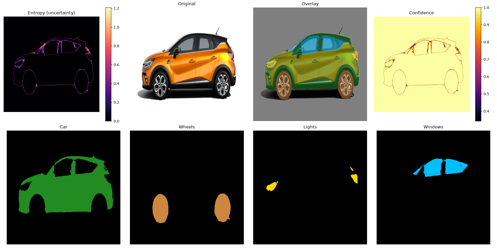
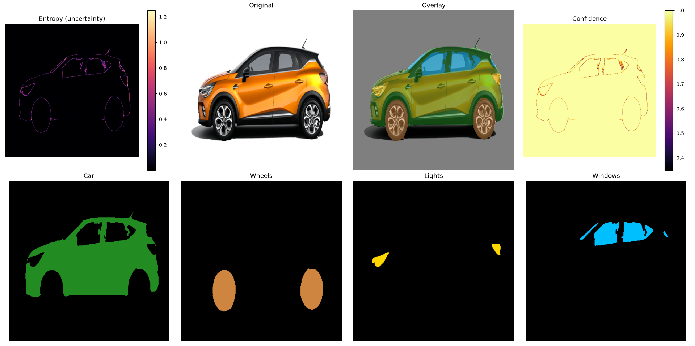
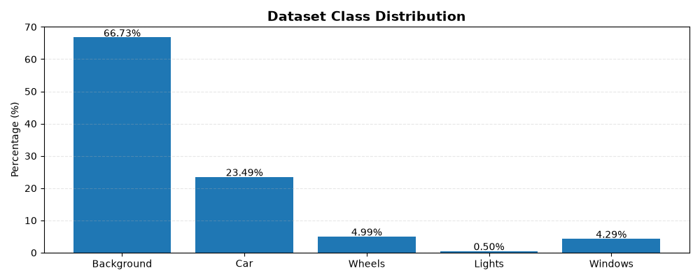
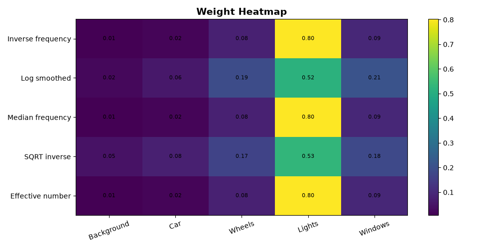

# Car Semantic Segmentation Web App (Multi-Model & Uncertainty Mapping)

This repository contains a full-stack Deep Learning and Computer Vision application focused on multi-class car semantic segmentation. 

Instead of just outputting standard pixel predictions, this interactive web dashboard evaluates model confidence by mapping **predictive entropy** and **boundary uncertainty**. The application allows users to upload a road scene image, select a trained deep learning model, and deeply analyze where the neural network feels confident or experiences ambiguity.

## 📊 Visual Comparison: DeepLab vs. MIT
To demonstrate model behaviors and how uncertainty shifts across different architectures, here is the visual output of the application processing the same car sample:

### 1. DeepLab Architecture Output


### 2. MIT Architecture Output


## 📊 Dataset Analysis & Training Performance
To ensure a robust training process, comprehensive exploratory data analysis (EDA) and performance tracking were conducted:

### 1. Class Distribution
An analysis of the dataset's class pixel distribution to understand balance across car body, wheels, windows, and background.


### 2. Training Metrics & Weight Analysis
Tracking network convergence and model weight distributions across training iterations.



## 🛠️ Features & Interactive Web Dashboard
- **Image Upload & Model Selection:** Upload road scenes and instantly swap between different trained architectures (DeepLab and MIT variants).
- **Advanced Metrics Visualization:**
  - **Overlap Display:** The original frame overlaid with the predicted multi-class car masks.
  - **Predictive Entropy:** A visual heatmap indicating pixel-level informational metrics.
  - **Model Uncertainty:** Explicit boundary error maps exposing where the network is architecturally ambiguous.
- **Component-Level Masking:** Separate class extractions for the car body, wheels, and windows (as shown in the segmented panels).
- **Downloadable Maps:** One-click download options for all three processed visual data outputs directly from the UI.
- **Custom Training:** Architectures trained from scratch, optimized for crisp edge detection and structural boundaries.

## Technologies Used
- **Deep Learning Framework:** Python & PyTorch
- **Computer Vision Processing:** OpenCV, NumPy, Matplotlib
- **Web Interface:** FastAPI
- **Model Architectures:** DeepLab, MIT-based networks

## Project Structure
```text
├── dataset/                  # Dataset loading and custom processing scripts
│   ├── dataset.py
│   ├── inference.py
│   ├── test.py
│   ├── train.py
│   └── transform.py          # Data augmentation and image transformations
├── images/                   # Documentation assets and README illustrations
├── model/                    # Core neural network architecture definitions
├── network/                  # Trained model checkpoints (weights)
│   ├── deeplab.pth
│   ├── mit.pth
│   └── resnext.pth
├── static/                   # Static frontend assets for the web dashboard
├── utils/                    # Helper scripts for metrics, analysis and extra features
│   ├── analyze.py            # Uncertainty and entropy computation logic
│   ├── benchmark.py
│   ├── check.py
│   ├── demo.py               # Core application / web dashboard execution script
│   ├── infer.py
│   ├── llm.py                # Post-processing textual explainer (Experimental)
│   └── weight.py
├── venv/                     # Python virtual environment (ignored in production)
├── network.txt
└── weight.txt
```

## How It Works (Brief Overview)
The backend processes the uploaded image through the selected PyTorch weights. Beside computing the standard argmax to isolate classes (body, wheels, windows), the system evaluates the raw probability distributions across pixels. This allows the framework to extract mathematical entropy and variance, exposing the network's internal uncertainty maps before rendering them to the frontend dashboard.

## License
This project is licensed under the MIT License - see the LICENSE file for details.
